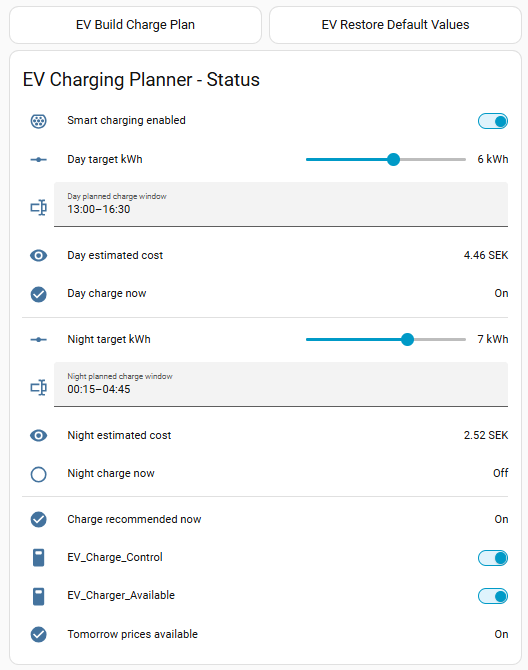
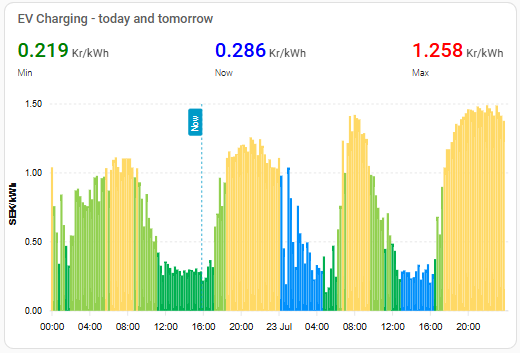
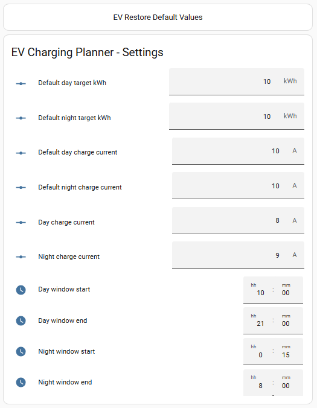

# Dashboard

The exported Home Assistant dashboard provides three complementary views of the
charging planner.

## Status and manual control

The status view shows whether smart charging is enabled, the current day and
night energy targets, the selected continuous charging windows, estimated
session costs, and whether charging is recommended at the current time. It also
exposes manual controls for the OCPP charge and availability switches and shows
whether tomorrow's Nord Pool prices are available.

The **EV Build Charge Plan** button recalculates the selected day and night
blocks. **EV Restore Default Values** resets the active targets and charging
currents to their configured defaults.

## Nord Pool price chart

The chart combines today's and tomorrow's 15-minute Nord Pool prices. The
header shows the minimum, current, and maximum price. Columns use price-based
colors, while selected charging blocks are highlighted in blue. The vertical
**Now** marker makes it easy to see the current quarter-hour slot.

## Planner settings

The settings view contains the default day and night energy targets, default
charging currents, active charging currents, and the allowed day and night time
windows. The restore button at the top applies the configured default values to
the active settings.
